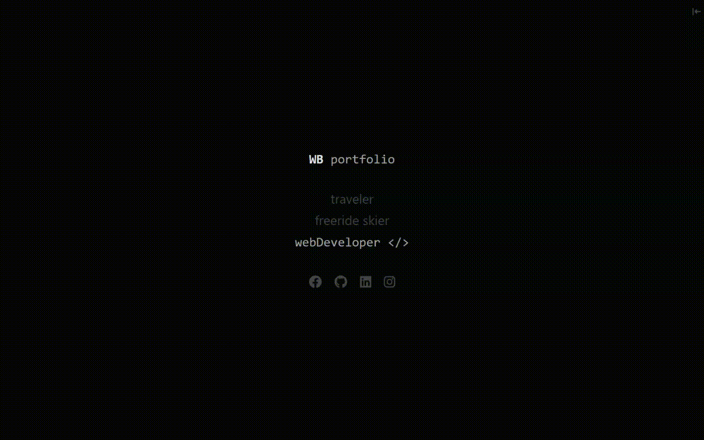

# `WB Portfolio`

[Open Portfolio](https://wblachut.github.io/my-react-portfolio/)

###

### ...work in progress!

In future this project will become personal web-site containing pages with information about my work, hobbies and portfolio. It is on it's early stage, consisting only portfolio at the moment.

## Description

The page was build as [React App](https://reactjs.org/).

On the page load personal information is displayed. I tried to make it simple and minimalistic. To show the portfolio click on the `webDeveloper` paragraph or on the `icon` in the left-top corner. The portfolio consists of 12 github `repositories`. Each of them is represented by the miniature images of the **demo page**. Hovering over them will cause gif and two icons to appear. The first one is a link to **project's demo page** the second one will take you to **project's github repository**.

## Concepts used:

- Functional Components
- Class Components
- Asynchronous data fetch from GitHub REST API inside of lifecycle method

### Do you like my portfolio?

Feel free to leave some comments. If you like the design I invite you to come back here after a year!

## Some concepts to apply in future:

- [ ] create a page for skiing and being ski instructor
- [ ] create a page about other hobbies, and `about`
- [ ] add an animated mind map of my skills
- [ ] add mouse effects while hovering over links on main page
- handling fetch with react hook eg. `useAsync`
- make main page more exciting but keeping still simple
- add a downloadable CV file.
- implement section with my friends testimonials
- make the portfolio responsive
